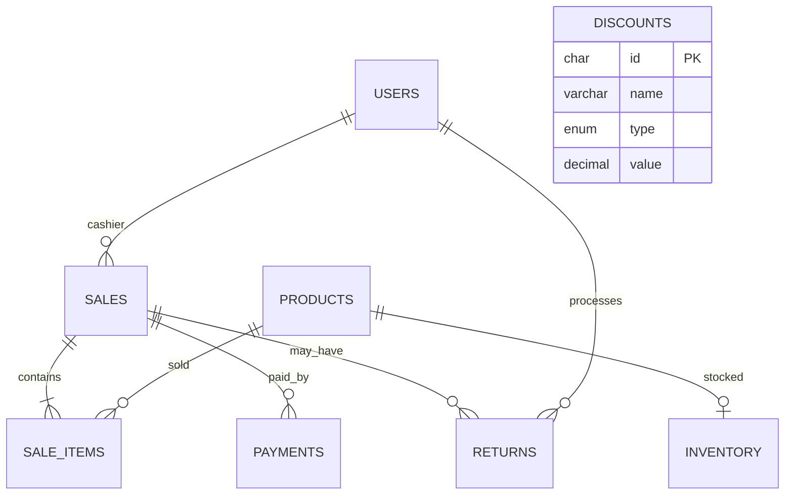

# Database schema

The normalized tables are `users`, `products`, `inventory`, `sales`, `sale_items`, `returns`, `payments`, and `discounts`. Foreign keys enforce product, user, sale, and payment relationships. `inventory.quantity` is updated in the same transaction as a MySQL sale.
