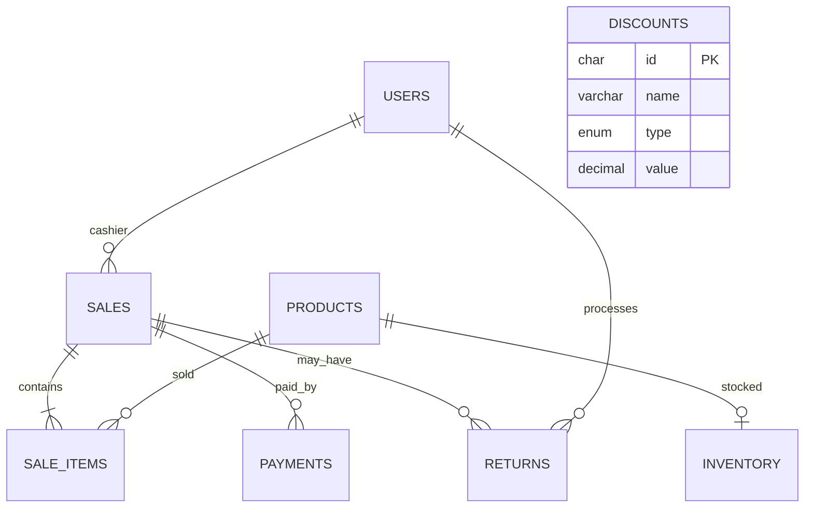

# Database schema

The normalized tables are `users`, `products`, `inventory`, `sales`, `sale_items`, `returns`, `payments`, and `discounts`. Foreign keys enforce product, user, sale, and payment relationships. `products.stock_quantity` is the API-facing stock field and is kept synchronized with `inventory.quantity` in the same MySQL transaction. Sales decrement both fields; validated returns increment both fields.

For an existing XAMPP/phpMyAdmin database, run `database/migration_stock_quantity.sql` once after the original schema. New installations can use `database/schema.sql` followed by `database/seed.sql`.
