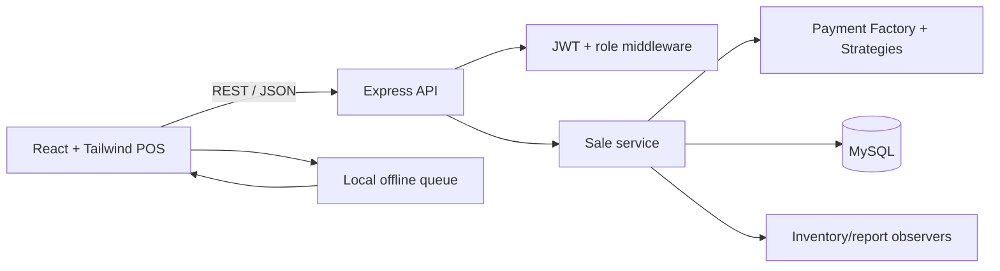

# FreshMart POS architecture

## Responsibility boundaries

- **Controller:** Express route handlers receive validated HTTP requests and translate them into application operations.
- **Information Expert:** the sale operation owns subtotal, promotion, tax, and total calculation; inventory owns stock quantities.
- **Creator:** `paymentFactory.js` creates the payment strategy selected by the request.
- **Low coupling / high cohesion:** database access, authentication middleware, payment strategies, demo data, and HTTP wiring are separate modules.
- **Dependency inversion:** route code calls the `query` database boundary; demo mode uses the same API contract without requiring MySQL.
- **Factory + Strategy:** `createPayment()` chooses `CashPayment`, `CardPayment`, `MobileMoneyPayment`, or `QrPayment`.
- **Observer direction:** the committed sale updates inventory and gives reporting queries a consistent source of truth. The browser also observes `online`/`offline` events to queue sales locally.
- **Singleton:** `getDb()` lazily creates one MySQL pool for the process.
- **MVC:** React views are the presentation layer, Express routes are controllers, and database/demo modules are the model boundary.

## Transaction guarantee

In MySQL mode, sale creation, sale items, inventory decrements, and payment creation run inside one transaction. A stock or payment failure rolls back the whole sale. The demo mode intentionally mirrors the public response shape so training and UI demos work without infrastructure.
